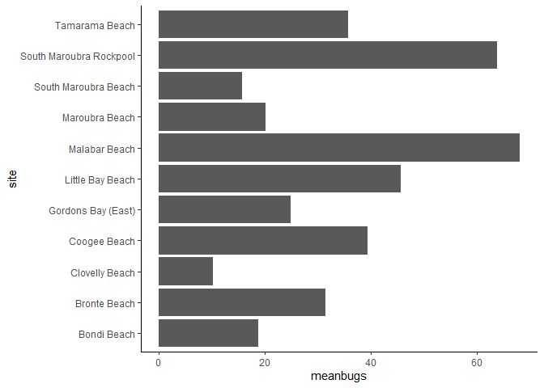

MarkyMark
================
Aaron R. Caldwell
2021-07-12

For this week watch and read the instructions for MarkMark 1-3

1.  <https://rladiessydney.org/courses/ryouwithme/04-markymark-1/>
2.  <https://rladiessydney.org/courses/ryouwithme/04-markymark-2/>
3.  <https://rladiessydney.org/courses/ryouwithme/04-markymark-3/>

The step by step answers/instructions can be found in the Week4 folder,
but I would suggest trying on your own first by watching the videos.

The output you should have at the end of class should be close to what I
have below\! Though I would encourage you to insert your own images and
tweets. If you run into errors (which I did on my rough draft of this
document) we can troubleshoot during class.

In order to knit this document as a pdf you will need to have `tinytex`,
an R package, installed.

# Headings

# One hash for main headings

## Two has for secondary headings

### Three has for tertiary headings

#### I think you get the idea…

# Bold and Italics

You can modify the display of text with asterisks

**I want this to be bold**

*I want italics*

I want to show \*asterisks\*

# Bullet points with dashes

  - Dash one
  - Dash two
  - Dash away all\!

There must be a space after the dash to get bullets.

# Quotes

Now get quotes with a \>

> “Rmarkdown was a major motiviation of mine to switch all of my data
> workflow to R.” - Aaron Caldwell

# Links

All you need is brackets for the text and paratheses with the URL

[find Rmd resources
here](https://github.com/jenrichmond/RMarkdownThrowdown)

# Images

Images are similar you just set a \! before the brackets and then the
file path. But we can also use the `include_graphics` function in the
knitr package. In my example code below we download an image from the
internet, save it and then use the image as output.

``` r
download.file(url = "https://aaroncaldwell.us/authors/admin/avatar_hucb0390a6bbbcd1a4b638e7b667551cb3_767338_270x270_fill_q90_lanczos_center.jpg",
          destfile = "image.png",
          mode = 'wb')
knitr::include_graphics(path = "image.png")
```


# Embed a tweet

Here is a good articlet to read on ggplot2\! You may run into errors if
you want to include emojis AND are knitting a pdf.

<blockquote class="twitter-tweet">

<p lang="en" dir="ltr">

So
<a href="https://twitter.com/emilynordmann?ref_src=twsrc%5Etfw">@emilynordmann</a>
said we could have celebratory drinks after this preprint was downloaded
1000 times. There’s less than 50 to go, so if you’ve ever wanted a
gentle intro to
<a href="https://twitter.com/hashtag/rstats?src=hash&amp;ref_src=twsrc%5Etfw">\#rstats</a>
through
<a href="https://twitter.com/hashtag/dataviz?src=hash&amp;ref_src=twsrc%5Etfw">\#dataviz</a>,
I encourage you to download it
<a href="https://t.co/L3Bl1kzpBQ">https://t.co/L3Bl1kzpBQ</a>

</p>

— Lisa DeBruine (@LisaDeBruine)
<a href="https://twitter.com/LisaDeBruine/status/1408725653785042945?ref_src=twsrc%5Etfw">June
26, 2021</a>

</blockquote>

<script async src="https://platform.twitter.com/widgets.js" charset="utf-8"></script>

Also insert HTML symbols like theta: Θ

# What about Code?

R markdown is nice because you can incorporate your code and get the
output you want in a tidy fashion.

Mac: alt-command-I Windows: alt-control-I

Remember, you can suppress messages and warnings in the header of the
chunks.

``` r
library(tidyverse)
# I can set the options globally with the following code
# This way I don't have to do it with every chunk
# But I can override it if I want
knitr::opts_chunk$set(echo = TRUE, 
                      message = FALSE,
                      warning = FALSE)
library(here)
library(janitor)
```

``` r
#Import beaches
beaches <- read_csv(here("data","sydneybeaches.csv"))
```

Now that we have data we can modify with our code from `basics.R`

``` r
cleanbeaches = beaches %>%
  clean_names() %>% # clean columns
  rename(beachbugs = enterococci_cfu_100ml)  %>%
  separate(date, c("day","month","year"),
           remove = FALSE) %>%
  #unite(council_site,council:site) %>%
  mutate(logbeachbugs = log(beachbugs),
         beachbugsdiff = beachbugs - lag(beachbugs),
         buggier = beachbugs > mean(beachbugs, na.rm=TRUE))
```

Then we can create neat data summaries and clean them up using `knitr`.

``` r
cleanbeaches %>%
  group_by(site) %>%
  summarize(meanbugs = mean(beachbugs,na.rm=TRUE)) %>%
  knitr::kable()
```

| site                    | meanbugs |
| :---------------------- | -------: |
| Bondi Beach             | 18.77545 |
| Bronte Beach            | 31.42090 |
| Clovelly Beach          | 10.21856 |
| Coogee Beach            | 39.37758 |
| Gordons Bay (East)      | 24.90062 |
| Little Bay Beach        | 45.61012 |
| Malabar Beach           | 68.11437 |
| Maroubra Beach          | 20.17910 |
| South Maroubra Beach    | 15.70536 |
| South Maroubra Rockpool | 63.89809 |
| Tamarama Beach          | 35.72836 |

Or we can plot the results.

``` r
cleanbeaches %>%
  group_by(site) %>%
  summarize(meanbugs = mean(beachbugs,na.rm=TRUE)) %>%
  ggplot(aes(x=site,y=meanbugs)) +
  geom_col() +
  coord_flip() +
  theme_classic()
```

<!-- -->

# Output

There are a multiple of output types to choose from.

  - Rstudio guide: <https://rmarkdown.rstudio.com/lesson-9.html>
  - Yihui guide:
    <https://bookdown.org/yihui/rmarkdown/output-formats.html>

Sometimes they will require extra installations. For example, pdf
documents are rendering using LaTex so you will need to have the
`tinytex` R package installed.

The header of the document will need to be modified in order to change
output styles. Though RStudio will allow you to use the knit button to
select the output style.

``` r
download.file(url = "https://bookdown.org/yihui/rmarkdown/images/format-dropdown.png",
          destfile = "dropdown.png",
          mode = 'wb')
knitr::include_graphics(path = "dropdown.png")
```


