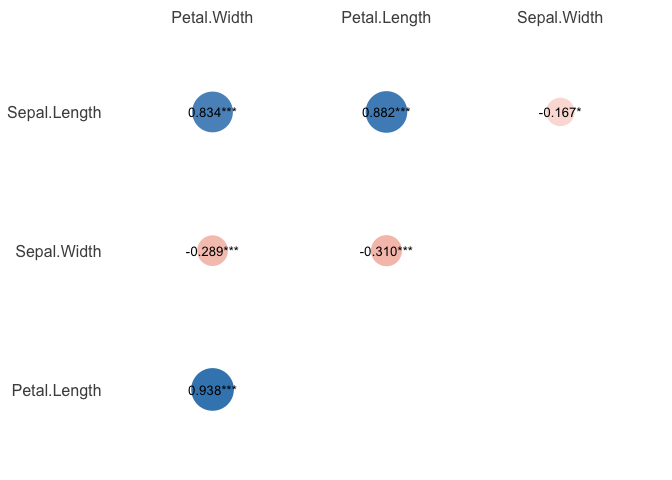
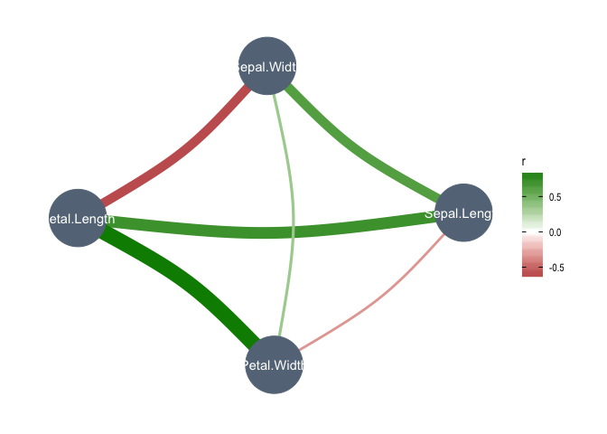
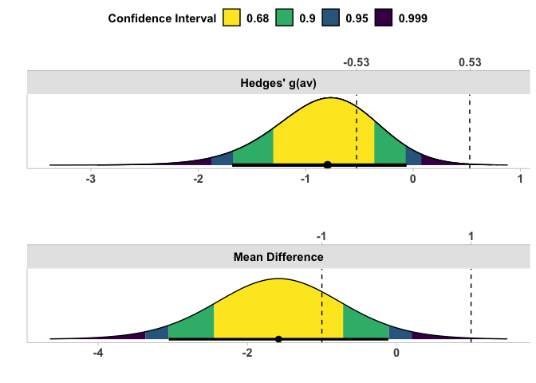

Week 5: Correlations, t-tests, ANOVAs, oh my!
================
Aaron R. Caldwell
6/28/2021

-   [Week 5 Answers](#week-5-answers)
-   [Useful Packages](#useful-packages)
-   [Correlations](#correlations)
    -   [Base R approach](#base-r-approach)
-   [t-test](#t-test)
    -   [Equivalence Test](#equivalence-test)
-   [ANOVA](#anova)

``` r
knitr::opts_chunk$set(echo = TRUE,
                      message = FALSE,
                      warning = FALSE)
library(tidyverse)
```

# Week 5 Answers

This week’s instructions were written in R now that everyone is aware of
how to use Rmarkdown.

Now we get down to what R was created for: statistics.

# Useful Packages

``` r
# statistics packages
# functions simliar to tidyverse
# install.packages("easystats", repos = "https://easystats.r-universe.dev")
library(easystats)

# For ANOVAs
library(afex)

# For equivalence testing
# Download the developmental version
# devtools::install_github("arcaldwell49/TOSTER")
library(TOSTER)
```

Now, let’s import the data we need for this week!

``` r
data("sleep")
data("ChickWeight")
data("iris")
```

# Correlations

> Let’s assume you are a botanist and are interested in the relationship
> between different measures of flower size. You are going to use the
> `iris` dataset to determine the correlation between 4 different
> meaures: sepal length, sepal width, petal length, and petal width.

This process isn’t too difficult with the `correlation` package, but we
could just as easily use the base version function `cor` or `cor.test`.

``` r
# First remove the species column
iris2 = iris %>%
  select(-Species)

correlation(iris2,
            method = "Pearson") %>%
  knitr::kable(caption = "Correlation: Pearson Coefficient")
```

| Parameter1   | Parameter2   |          r |   CI |    CI\_low |   CI\_high |         t | df\_error |         p | Method              | n\_Obs |
|:-------------|:-------------|-----------:|-----:|-----------:|-----------:|----------:|----------:|----------:|:--------------------|-------:|
| Sepal.Length | Sepal.Width  | -0.1175698 | 0.95 | -0.2726932 |  0.0435116 | -1.440287 |       148 | 0.1518983 | Pearson correlation |    150 |
| Sepal.Length | Petal.Length |  0.8717538 | 0.95 |  0.8270363 |  0.9055080 | 21.646019 |       148 | 0.0000000 | Pearson correlation |    150 |
| Sepal.Length | Petal.Width  |  0.8179411 | 0.95 |  0.7568971 |  0.8648361 | 17.296454 |       148 | 0.0000000 | Pearson correlation |    150 |
| Sepal.Width  | Petal.Length | -0.4284401 | 0.95 | -0.5508771 | -0.2879499 | -5.768449 |       148 | 0.0000001 | Pearson correlation |    150 |
| Sepal.Width  | Petal.Width  | -0.3661259 | 0.95 | -0.4972130 | -0.2186966 | -4.786461 |       148 | 0.0000081 | Pearson correlation |    150 |
| Petal.Length | Petal.Width  |  0.9628654 | 0.95 |  0.9490525 |  0.9729853 | 43.387237 |       148 | 0.0000000 | Pearson correlation |    150 |

Correlation: Pearson Coefficient

``` r
correlation(iris2,
            method = "Spearman") %>%
  knitr::kable(caption = "Correlation: Spearman Coefficient")
```

| Parameter1   | Parameter2   |        rho |   CI |    CI\_low |   CI\_high |         S |         p | Method               | n\_Obs |
|:-------------|:-------------|-----------:|-----:|-----------:|-----------:|----------:|----------:|:---------------------|-------:|
| Sepal.Length | Sepal.Width  | -0.1667777 | 0.95 | -0.3228132 | -0.0019162 | 656283.26 | 0.0413680 | Spearman correlation |    150 |
| Sepal.Length | Petal.Length |  0.8818981 | 0.95 |  0.8390070 |  0.9138974 |  66429.35 | 0.0000000 | Spearman correlation |    150 |
| Sepal.Length | Petal.Width  |  0.8342888 | 0.95 |  0.7761639 |  0.8783537 |  93208.42 | 0.0000000 | Spearman correlation |    150 |
| Sepal.Width  | Petal.Length | -0.3096351 | 0.95 | -0.4514945 | -0.1525085 | 736637.00 | 0.0003462 | Spearman correlation |    150 |
| Sepal.Width  | Petal.Width  | -0.2890317 | 0.95 | -0.4332929 | -0.1303298 | 725048.13 | 0.0006686 | Spearman correlation |    150 |
| Petal.Length | Petal.Width  |  0.9376668 | 0.95 |  0.9141048 |  0.9549177 |  35060.85 | 0.0000000 | Spearman correlation |    150 |

Correlation: Spearman Coefficient

We can also plot the results to visualize the relationship.

``` r
correlation(iris2,
            method = "Spearman") %>%
  summary()%>%
  plot(show_values = TRUE, show_p = TRUE, show_legend = FALSE)
```

<!-- -->

Fun note: you can even plot the *partial* correlations.

``` r
# You will need ggpraph
library(ggraph)
correlation(iris2,
            partial = TRUE) %>%
  plot()
```

<!-- -->

## Base R approach

As I mentioned before you can use the `cor.test` is there is a
particular correlation you want to test. This is useful if you do not
want to create a matrix of results.

As an example, let’s use `cor.test` to test the relationship between
sepal length and petal length.

``` r
sepal_length = iris$Sepal.Length
petal_length = iris$Petal.Length
test1 = cor.test(sepal_length,petal_length)
# Now we can print the result
test1
```

    ## 
    ##  Pearson's product-moment correlation
    ## 
    ## data:  sepal_length and petal_length
    ## t = 21.646, df = 148, p-value < 2.2e-16
    ## alternative hypothesis: true correlation is not equal to 0
    ## 95 percent confidence interval:
    ##  0.8270363 0.9055080
    ## sample estimates:
    ##       cor 
    ## 0.8717538

However, we can also use the `report` package to get a summary of the
result.

``` r
test = report(test1)
test
```

    ## Effect sizes were labelled following Funder's (2019) recommendations.
    ## 
    ## The Pearson's product-moment correlation between sepal_length and petal_length is positive, statistically significant, and very large (r = 0.87, 95% CI [0.83, 0.91], t(148) = 21.65, p < .001)

Effect sizes were labelled following Funder’s (2019) recommendations.

The Pearson’s product-moment correlation between sepal\_length and
petal\_length is positive, statistically significant, and very large (r
= 0.87, 95% CI \[0.83, 0.91\], t(148) = 21.65, p &lt; .001)

# t-test

> Let’s compare the groups (i.e., drug) in the “sleep” dataset and see
> if there is a difference in the hours of sleep each night

## Equivalence Test

``` r
# remember library(TOSTER)

TOSTsleep = t_TOST(extra ~ group,
                   data = sleep,
                   low_eqbound = -1,
                   high_eqbound = 1)

TOSTsleep
```

    ## 
    ## Welch Two Sample t-test
    ## Hypothesis Tested: Equivalence
    ## Equivalence Bounds (raw):-1.000 & 1.000
    ## Alpha Level:0.05
    ## The equivalence test was non-significant, t(17.78) = -0.683, p = 7.48e-01
    ## The null hypothesis test was non-significant, t(17.78) = -1.861, p = 7.94e-02
    ## NHST: don't reject null significance hypothesis that the effect is equal to zero 
    ##  TOST: don't reject null equivalence hypothesis
    ## 
    ## TOST Results 
    ##                     t       SE       df     p.value
    ## t-test     -1.8608135 0.849091 17.77647 0.079394140
    ## TOST Lower -0.6830834 0.849091 17.77647 0.748319811
    ## TOST Upper -3.0385435 0.849091 17.77647 0.003570669
    ## 
    ## Effect Sizes 
    ##                 estimate       SE  lower.ci    upper.ci conf.level
    ## Raw           -1.5800000 0.849091 -3.053381 -0.10661850        0.9
    ## Hedges' g(av) -0.7964846 0.497633 -1.684326 -0.06154947        0.9
    ## 
    ## Note: SMD confidence intervals are an approximation. See vignette("SMD_calcs").

``` r
plot(TOSTsleep)
```

<!-- -->

# ANOVA
