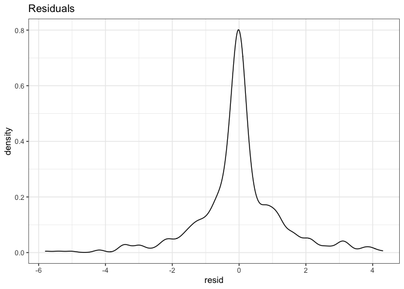
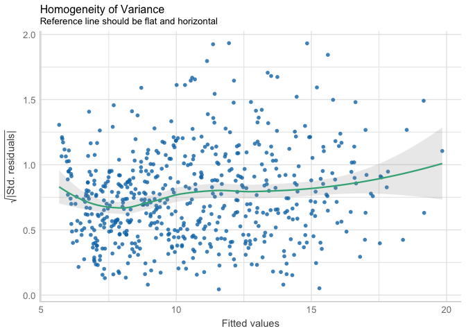

Week 5: Correlations, t-tests, ANOVAs, oh my!
================
Aaron R. Caldwell

-   [Week 5 Answers](#week-5-answers)
-   [Useful Packages](#useful-packages)
-   [Correlations](#correlations)
    -   [Base R approach](#base-r-approach)
-   [t-test](#t-test)
    -   [Non-parametric tests](#non-parametric-tests)
    -   [Equivalence Test](#equivalence-test)
-   [ANOVA](#anova)
    -   [Additional Analysis](#additional-analysis)

``` r
knitr::opts_chunk$set(echo = TRUE,
                      message = FALSE,
                      warning = FALSE)
library(tidyverse)
```

# Week 5 Answers

This week’s instructions were written in R now that everyone is aware of
how to use Rmarkdown.

Now we get down to what R was created for: statistics.

# Useful Packages

``` r
# statistics packages
# functions simliar to tidyverse
# install.packages("easystats", repos = "https://easystats.r-universe.dev")
library(easystats)

# For ANOVAs
library(afex)

# For equivalence testing
# Download the developmental version
# devtools::install_github("arcaldwell49/TOSTER")
library(TOSTER)
```

Now, let’s import the data we need for this week!

``` r
data("sleep")
data("ChickWeight")
data("iris")
```

# Correlations

> Let’s assume you are a botanist and are interested in the relationship
> between different measures of flower size. You are going to use the
> `iris` dataset to determine the correlation between 4 different
> meaures: sepal length, sepal width, petal length, and petal width.

This process isn’t too difficult with the `correlation` package, but we
could just as easily use the base version function `cor` or `cor.test`.

``` r
# First remove the species column
iris2 = iris %>%
  select(-Species)

correlation(iris2,
            method = "Pearson") %>%
  knitr::kable(caption = "Correlation: Pearson Coefficient")
```

| Parameter1   | Parameter2   |          r |   CI |    CI\_low |   CI\_high |         t | df\_error |         p | Method              | n\_Obs |
|:-------------|:-------------|-----------:|-----:|-----------:|-----------:|----------:|----------:|----------:|:--------------------|-------:|
| Sepal.Length | Sepal.Width  | -0.1175698 | 0.95 | -0.2726932 |  0.0435116 | -1.440287 |       148 | 0.1518983 | Pearson correlation |    150 |
| Sepal.Length | Petal.Length |  0.8717538 | 0.95 |  0.8270363 |  0.9055080 | 21.646019 |       148 | 0.0000000 | Pearson correlation |    150 |
| Sepal.Length | Petal.Width  |  0.8179411 | 0.95 |  0.7568971 |  0.8648361 | 17.296454 |       148 | 0.0000000 | Pearson correlation |    150 |
| Sepal.Width  | Petal.Length | -0.4284401 | 0.95 | -0.5508771 | -0.2879499 | -5.768449 |       148 | 0.0000001 | Pearson correlation |    150 |
| Sepal.Width  | Petal.Width  | -0.3661259 | 0.95 | -0.4972130 | -0.2186966 | -4.786461 |       148 | 0.0000081 | Pearson correlation |    150 |
| Petal.Length | Petal.Width  |  0.9628654 | 0.95 |  0.9490525 |  0.9729853 | 43.387237 |       148 | 0.0000000 | Pearson correlation |    150 |

Correlation: Pearson Coefficient

``` r
correlation(iris2,
            method = "Spearman") %>%
  knitr::kable(caption = "Correlation: Spearman Coefficient")
```

| Parameter1   | Parameter2   |        rho |   CI |    CI\_low |   CI\_high |         S |         p | Method               | n\_Obs |
|:-------------|:-------------|-----------:|-----:|-----------:|-----------:|----------:|----------:|:---------------------|-------:|
| Sepal.Length | Sepal.Width  | -0.1667777 | 0.95 | -0.3228132 | -0.0019162 | 656283.26 | 0.0413680 | Spearman correlation |    150 |
| Sepal.Length | Petal.Length |  0.8818981 | 0.95 |  0.8390070 |  0.9138974 |  66429.35 | 0.0000000 | Spearman correlation |    150 |
| Sepal.Length | Petal.Width  |  0.8342888 | 0.95 |  0.7761639 |  0.8783537 |  93208.42 | 0.0000000 | Spearman correlation |    150 |
| Sepal.Width  | Petal.Length | -0.3096351 | 0.95 | -0.4514945 | -0.1525085 | 736637.00 | 0.0003462 | Spearman correlation |    150 |
| Sepal.Width  | Petal.Width  | -0.2890317 | 0.95 | -0.4332929 | -0.1303298 | 725048.13 | 0.0006686 | Spearman correlation |    150 |
| Petal.Length | Petal.Width  |  0.9376668 | 0.95 |  0.9141048 |  0.9549177 |  35060.85 | 0.0000000 | Spearman correlation |    150 |

Correlation: Spearman Coefficient

We can also plot the results to visualize the relationship.

``` r
correlation(iris2,
            method = "Spearman") %>%
  summary()%>%
  plot(show_values = TRUE, show_p = TRUE, show_legend = FALSE)
```

<!-- -->

Fun note: you can even plot the *partial* correlations.

``` r
# You will need ggpraph
library(ggraph)
correlation(iris2,
            partial = TRUE) %>%
  plot()
```

<!-- -->

## Base R approach

As I mentioned before you can use the `cor.test` is there is a
particular correlation you want to test. This is useful if you do not
want to create a matrix of results.

As an example, let’s use `cor.test` to test the relationship between
sepal length and petal length.

``` r
sepal_length = iris$Sepal.Length
petal_length = iris$Petal.Length
test1 = cor.test(sepal_length,petal_length)
# Now we can print the result
test1
```

    ## 
    ##  Pearson's product-moment correlation
    ## 
    ## data:  sepal_length and petal_length
    ## t = 21.646, df = 148, p-value < 2.2e-16
    ## alternative hypothesis: true correlation is not equal to 0
    ## 95 percent confidence interval:
    ##  0.8270363 0.9055080
    ## sample estimates:
    ##       cor 
    ## 0.8717538

However, we can also use the `report` package to get a summary of the
result.

    report(test1)

Effect sizes were labelled following Funder’s (2019) recommendations.

The Pearson’s product-moment correlation between sepal\_length and
petal\_length is positive, statistically significant, and very large (r
= 0.87, 95% CI \[0.83, 0.91\], t(148) = 21.65, p &lt; .001)

# t-test

> Let’s compare the groups (i.e., drug) in the “sleep” dataset and see
> if there is a difference in the hours of sleep each night

So, in this scenario you are trying to test if there are difference
between two treatments. Let’s check the data and see what it looks like.

``` r
knitr::kable(sleep)
```

| extra | group | ID  |
|------:|:------|:----|
|   0.7 | 1     | 1   |
|  -1.6 | 1     | 2   |
|  -0.2 | 1     | 3   |
|  -1.2 | 1     | 4   |
|  -0.1 | 1     | 5   |
|   3.4 | 1     | 6   |
|   3.7 | 1     | 7   |
|   0.8 | 1     | 8   |
|   0.0 | 1     | 9   |
|   2.0 | 1     | 10  |
|   1.9 | 2     | 1   |
|   0.8 | 2     | 2   |
|   1.1 | 2     | 3   |
|   0.1 | 2     | 4   |
|  -0.1 | 2     | 5   |
|   4.4 | 2     | 6   |
|   5.5 | 2     | 7   |
|   1.6 | 2     | 8   |
|   4.6 | 2     | 9   |
|   3.4 | 2     | 10  |

Notice how the ID repeats between treatments? That means we have a
*paired* sample; meaning that each participant was exposed to **both**
conditions. This means we will use a paired samples t-test to test for
differences in the mean increase in the hours of sleep (`extra`).

Luckily, R makes this easy with the built in `t.test` function.

``` r
# formula approach
ttest1 = t.test(extra ~ group,
                data = sleep,
                paired = TRUE)

# 2 vector approach

ttest2 = t.test(x = subset(sleep, group ==1)$extra,
                y = subset(sleep, group ==2)$extra,
                paired = TRUE)

ttest1
```

    ## 
    ##  Paired t-test
    ## 
    ## data:  extra by group
    ## t = -4.0621, df = 9, p-value = 0.002833
    ## alternative hypothesis: true difference in means is not equal to 0
    ## 95 percent confidence interval:
    ##  -2.4598858 -0.7001142
    ## sample estimates:
    ## mean of the differences 
    ##                   -1.58

Again, we can use the `report` function to get a tidy text output

    report(ttest1)

Effect sizes were labelled following Cohen’s (1988) recommendations.

The Paired t-test testing the difference of extra by group (mean of the
differences = -1.58) suggests that the effect is negative, statistically
significant, and large (difference = -1.58, 95% CI \[-2.46, -0.70\],
t(9) = -4.06, p = 0.003; Cohen’s d = -1.35, 95% CI \[-2.23, -0.44\])

## Non-parametric tests

Sometimes we the assumptions of a t-test (e.g., normal residuals) are
not tenable. In these situations we can use a non-parametric test like
the Wilcoxon signed rank test (test of ranks).

The `wilcox.test` function performs this analysis and works just like
the `t.test` function.

``` r
# formula approach
wtest1 = wilcox.test(extra ~ group,
                data = sleep,
                paired = TRUE)

# 2 vector approach

wtest2 = wilcox.test(x = subset(sleep, group ==1)$extra,
                y = subset(sleep, group ==2)$extra,
                paired = TRUE)

wtest1
```

    ## 
    ##  Wilcoxon signed rank test with continuity correction
    ## 
    ## data:  extra by group
    ## V = 0, p-value = 0.009091
    ## alternative hypothesis: true location shift is not equal to 0

The report function does not work for this type of result at this time,
but you can get an effect size measure (rank-biserial correlation) from
the `effectsize package`.

``` r
effectsize::rank_biserial(subset(sleep, group == 1)$extra,
                          subset(sleep, group == 2)$extra)
```

    ## r (rank biserial) |         95% CI
    ## ----------------------------------
    ## -0.49             | [-0.78, -0.02]

## Equivalence Test

Let’s say we are interested in equivalence. For example, we may have
developed a new drug and want to make sure it equivalent to the old drug
when it comes to extra hours of sleep. That is where the `TOSTER`
package and the new `t_TOST` function can be useful. The setup is almost
exactly the same; but we just going to set upper and lower equivalence
bounds.

``` r
# remember library(TOSTER)

TOSTsleep = t_TOST(
  extra ~ group,
  data = sleep,
  low_eqbound = -1,
  high_eqbound = 1,
  paired = TRUE
)

TOSTsleep
```

    ## 
    ## Paired t-test
    ## Hypothesis Tested: Equivalence
    ## Equivalence Bounds (raw):-1.000 & 1.000
    ## Alpha Level:0.05
    ## The equivalence test was non-significant, t(9) = -1.491, p = 9.15e-01
    ## The null hypothesis test was significant, t(9) = -4.062, p = 2.83e-03
    ## NHST: reject null significance hypothesis that the effect is equal to zero 
    ##  TOST: don't reject null equivalence hypothesis
    ## 
    ## TOST Results 
    ##                    t        SE df      p.value
    ## t-test     -4.062128 0.3889587  9 2.832890e-03
    ## TOST Lower -1.491161 0.3889587  9 9.149441e-01
    ## TOST Upper -6.633095 0.3889587  9 4.778596e-05
    ## 
    ## Effect Sizes 
    ##               estimate        SE  lower.ci   upper.ci conf.level
    ## Raw          -1.580000 0.3889587 -2.293005 -0.8669947        0.9
    ## Hedges' g(z) -1.230152 0.2008070 -1.848296 -0.8362302        0.9
    ## 
    ## Note: SMD confidence intervals are an approximation. See vignette("SMD_calcs").

``` r
plot(TOSTsleep)
```

<!-- -->

# ANOVA

> Suppose you are an animal scientist and you have data on different
> diets fed to chickens over 21 weeks. Let’s assume the scientist wants
> to test if the weight of the chicks is moderated by diet over time

As with many things in R there are literally dozens of ways to run an
ANOVA. The main issue is that many of the options, like base R’s `aov`
function, are limited in scope (e.g., don’t handle within subjects
factors appropriately). This is where the `afex` R package (afex =
“Analysis of Factorial Experiments”) can be very useful. It essentially
makes the process of performing and reporting an ANOVA much easier for
the average R user.

For this particular test, we have data that is in long format and is
repeated measures. We need our model to include a within subjects
factor, `Time`, across chicks, `Chick`, and include a between subjects
interaction for diet, `Diet`, for the outcome variable (`weight`).

For `afex`, there are three different functions that can provide the
solution: `aov_ez`, `aov_car`, and `aov_4`. My preference is `aov_4`
because it functions similarly to other functions that involve linear
mixed models (so it is easier for me to conceptualize).

The first is `aov_ez` where we can tell the function our id variable
(`Chick`), the dependent variable (`weight`), and the we specifically
specify the data, between subjects variables, and within subjects
variables. Lastly, I specify that I want the partial eta-squared.

``` r
a1 <- aov_ez(
  id = "Chick",
  dv = "weight",
  data = ChickWeight,
  between = "Diet",
  within = c("Time"),
  anova_table = list(es = "pes")
)
a1
```

    ## Anova Table (Type 3 tests)
    ## 
    ## Response: weight
    ##      Effect          df     MSE          F  pes p.value
    ## 1      Diet       3, 41 7646.22    5.07 ** .271    .004
    ## 2      Time 1.26, 51.48 5736.71 280.95 *** .873   <.001
    ## 3 Diet:Time 3.77, 51.48 5736.71     3.77 * .216    .010
    ## ---
    ## Signif. codes:  0 '***' 0.001 '**' 0.01 '*' 0.05 '+' 0.1 ' ' 1
    ## 
    ## Sphericity correction method: GG

The same process can be completed with the `aov_car` function but I have
to specify the error term.

``` r
a2 <- aov_car(weight ~ Diet + Error(Chick / Time),
              data = ChickWeight,
              anova_table = list(es = "pes"))
a2
```

    ## Anova Table (Type 3 tests)
    ## 
    ## Response: weight
    ##      Effect          df     MSE          F  pes p.value
    ## 1      Diet       3, 41 7646.22    5.07 ** .271    .004
    ## 2      Time 1.26, 51.48 5736.71 280.95 *** .873   <.001
    ## 3 Diet:Time 3.77, 51.48 5736.71     3.77 * .216    .010
    ## ---
    ## Signif. codes:  0 '***' 0.001 '**' 0.01 '*' 0.05 '+' 0.1 ' ' 1
    ## 
    ## Sphericity correction method: GG

Lastly, there is `aov_4` which uses a format very similar to the mixed
models functions in R (random/within separated by `|` for the id
variable.

``` r
a3 <- aov_4(weight ~ Diet + (Time|Chick),
              data = ChickWeight,
              anova_table = list(es = "pes"))
a3
```

    ## Anova Table (Type 3 tests)
    ## 
    ## Response: weight
    ##      Effect          df     MSE          F  pes p.value
    ## 1      Diet       3, 41 7646.22    5.07 ** .271    .004
    ## 2      Time 1.26, 51.48 5736.71 280.95 *** .873   <.001
    ## 3 Diet:Time 3.77, 51.48 5736.71     3.77 * .216    .010
    ## ---
    ## Signif. codes:  0 '***' 0.001 '**' 0.01 '*' 0.05 '+' 0.1 ' ' 1
    ## 
    ## Sphericity correction method: GG

However, let’s plot the residuals of the data to see if our assumptions
are met. We can see from the plots below that the residuals are
leptokurtic and heteroskedasticity is extreme.

``` r
# Get residuals
d1 = residuals(a3,
               append = TRUE,
               colname_residuals = "resid") %>%
  as_tibble()

# Get fitte values
d2 = fitted(a3,
               append = TRUE,
               colname_fitted = "fitted") %>%
  as_tibble()

# Put together
d1$fitted = d2$fitted 
d1 = d1 %>%  mutate(std_resid = resid / sd(resid))
  

ggplot(d1,
       aes(x=resid)) +
  geom_density() +
  theme_bw() +
  labs(title = "Residuals")
```

<!-- -->

``` r
ggplot(d1,
       aes(y=sqrt(abs(std_resid)),
           x = fitted)) +
  geom_point() +
  geom_smooth(method="loess",
              formula = y ~ x) +
  theme_bw() +
  labs(title = "Homogeneity of Variance")
```

<!-- -->

Therefore, we can transform the data to “normalize” the residuals. We
can see here that the repeated measures ANOVA still doesn’t quite meet
our assumptions tests, but it probably wouldn’t be tragic to use this
model either. However, please note that time is being treated as a
continuous variable which is wildly inefficient.

``` r
a4 = aov_4(
  sqrt(weight) ~ Diet + (Time | Chick),
  data = ChickWeight,
  anova_table = list(es = "pes")
)
```

``` r
# Get residuals
d1 = residuals(a4,
               append = TRUE,
               colname_residuals = "resid") %>%
  as_tibble()

# Get fitte values
d2 = fitted(a4,
               append = TRUE,
               colname_fitted = "fitted") %>%
  as_tibble()

# Put together
d1$fitted = d2$fitted 
d1 = d1 %>%  mutate(std_resid = resid / sd(resid))
  

ggplot(d1,
       aes(x=resid)) +
  geom_density() +
  theme_bw() +
  labs(title = "Residuals")
```

<!-- -->

``` r
ggplot(d1,
       aes(y=sqrt(abs(std_resid)),
           x = fitted)) +
  geom_point() +
  geom_smooth(method="loess",
              formula = y ~ x) +
  theme_bw() +
  labs(title = "Homogeneity of Variance")
```

<!-- -->

``` r
afex_plot(a4,
          x = "Time",
          trace = "Diet",
          panel = "Diet",
          data_plot = FALSE)
```

<!-- -->

## Additional Analysis

So let’s look at the data a different way. Let’s give each Chick an
individual slope and separate by group.

``` r
ChickWeight %>%
  drop_na() %>%
ggplot(aes(x=Time,
           y=weight,
           color = Chick))+
  geom_point(alpha = .1) +
  geom_smooth(method = "lm",
              formula = y~x,
              se = FALSE) +
  scale_color_viridis_d(option = "plasma") +
  facet_wrap(~Diet, labeller = "label_both") +
  theme_bw() +
  theme(legend.position = "none") 
```

<!-- -->

So it appears there is quite a bit of varying responses to “time” and
possibly to diet. So, we can use a linear mixed model rather than the
repeated measures ANOVA. The details aren’t too important now, but in
this case we have random slope and intercept for `Chick`.

``` r
library(lme4)

lmer_raw = lmer(weight ~ Diet * as.numeric(Time) + (Time | Chick),
                data = ChickWeight)

anova(lmer_raw) %>%
  knitr::kable()
```

|                       |    Sum Sq |    Mean Sq | NumDF |    DenDF |    F value | Pr(&gt;F) |
|:----------------------|----------:|-----------:|------:|---------:|-----------:|----------:|
| Diet                  |  1637.702 |   545.9007 |     3 | 45.97132 |   3.341462 | 0.0271843 |
| as.numeric(Time)      | 53171.292 | 53171.2923 |     1 | 45.44451 | 325.461811 | 0.0000000 |
| Diet:as.numeric(Time) |  2791.846 |   930.6155 |     3 | 45.54097 |   5.696303 | 0.0021271 |

``` r
dat_resid = ChickWeight %>%
  mutate()
```

Let’s check the model again this time. However, this time we can use the
`easystats` functions from the `see` package. The results… aren’t much
better.

``` r
# Check normality
check <- check_normality(lmer_raw)
```

    ## Warning: Non-normality of residuals detected (p < .001).

``` r
plot(check, type = "qq")
```

<!-- -->

``` r
plot(check)
```

<!-- -->

``` r
# Check Variance
check2 <- check_heteroscedasticity(lmer_raw)
```

    ## Warning: Heteroscedasticity (non-constant error variance) detected (p < .001).

``` r
plot(check2)
```

<!-- -->

However, let’s run the model with a square root transformation.

``` r
lmer_sq = lmer(sqrt(weight) ~ Diet*as.numeric(Time)+(Time|Chick),
                data = ChickWeight)

anova(lmer_sq) %>%
  knitr::kable()
```

|                       |    Sum Sq |    Mean Sq | NumDF |    DenDF |    F value | Pr(&gt;F) |
|:----------------------|----------:|-----------:|------:|---------:|-----------:|----------:|
| Diet                  |  1.145675 |  0.3818915 |     3 | 45.66535 |   2.044681 | 0.1208408 |
| as.numeric(Time)      | 90.651586 | 90.6515865 |     1 | 45.07901 | 485.356496 | 0.0000000 |
| Diet:as.numeric(Time) |  2.857942 |  0.9526473 |     3 | 45.16447 |   5.100557 | 0.0039956 |

And, if we check the model, the residuals appear to be more “normal” and
conform to the assumptions of a Gaussian linear model. Now, the test for
normality is still “significant”, but the visualizations indicate that
the violations of these assumptions may not be too terrible.

``` r
# Check normality
check <- check_normality(lmer_sq)
```

    ## Warning: Non-normality of residuals detected (p < .001).

``` r
plot(check, type = "qq")
```

<!-- -->

``` r
plot(check)
```

<!-- -->

``` r
plot(check_normality(lmer_sq, effects = "random"))
```

    ## Group: Chick
    ## (Intercept) OK: random effects appear as normally distributed (p = 0.678).
    ##        Time OK: random effects appear as normally distributed (p = 0.866).

    ## [[1]]

<!-- -->

``` r
# Check Variance
check2 <- check_heteroscedasticity(lmer_sq)
```

    ## OK: Error variance appears to be homoscedastic (p = 0.590).

``` r
plot(check2)
```

<!-- -->

Remember

> All models are wrong but some are useful - George Box

We can also check the differences in slope by using the `emmeans`
package. This package can also be used for post-hoc comparisons.

-   See [this
    vignette](https://cran.r-project.org/web/packages/emmeans/vignettes/interactions.html)
    for more details on using `emmeans`

``` r
library(emmeans)
emtrends(lmer_sq, pairwise ~ Diet, var = "Time",
         adjust = "holm")
```

    ## $emtrends
    ##  Diet Time.trend     SE   df lower.CL upper.CL
    ##  1         0.312 0.0284 46.5    0.254    0.369
    ##  2         0.393 0.0393 44.9    0.314    0.472
    ##  3         0.491 0.0393 44.9    0.412    0.570
    ##  4         0.431 0.0394 45.0    0.352    0.510
    ## 
    ## Degrees-of-freedom method: kenward-roger 
    ## Confidence level used: 0.95 
    ## 
    ## $contrasts
    ##  contrast estimate     SE   df t.ratio p.value
    ##  1 - 2     -0.0814 0.0485 45.4 -1.678  0.3414 
    ##  1 - 3     -0.1793 0.0485 45.4 -3.695  0.0035 
    ##  1 - 4     -0.1195 0.0485 45.5 -2.461  0.0885 
    ##  2 - 3     -0.0979 0.0556 44.9 -1.759  0.3414 
    ##  2 - 4     -0.0381 0.0557 44.9 -0.684  0.5764 
    ##  3 - 4      0.0598 0.0557 44.9  1.075  0.5764 
    ## 
    ## Degrees-of-freedom method: kenward-roger 
    ## P value adjustment: holm method for 6 tests

``` r
emmip(lmer_sq, Diet ~ Time, cov.reduce = range) +
  theme_classic() +
  scale_color_viridis_d(option = "plasma")
```

<!-- -->

We can also plot the model predictions estimates per group using the
`interactions` package.

-   See [this
    vignette](https://cran.r-project.org/web/packages/interactions/vignettes/interactions.html)
    for more details

``` r
library(interactions)
interact_plot(lmer_sq, pred = Time, modx = Diet, interval = TRUE,
              int.width = 0.8,
              data = ChickWeight)
```

<!-- -->

``` r
ss <- sim_margins(lmer_sq, pred = Time, modx = Diet)
plot(ss)
```

<!-- -->
